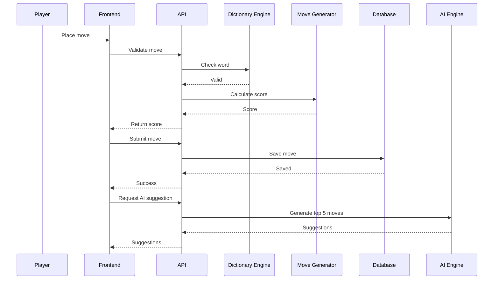

# API Specification.md

# Scrabble AI Assistant API

Version: 1.0 (MVP)

Base URL:

```txt
Development:
http://localhost:8000/api

Production:
https://api.scrabble-ai.com/api
```

API Style:

```txt
REST API
JSON Request/Response
JWT Authentication (future)
```

Current MVP:

```txt
No login required
Local two-player simulation only
```

---

# Standard Response Format

Success:

```json
{
    "success": true,
    "data": {},
    "message": "Request successful"
}
```

Error:

```json
{
    "success": false,
    "error": {
        "code": "INVALID_MOVE",
        "message": "Move cannot be placed"
    }
}
```

---

# Game Endpoints

## Create Game

Endpoint:

```http
POST /games
```

Purpose:

Create a new game session.

Request:

```json
{
    "dictionary":"TWL",
    "players":[
        {
            "name":"Player 1"
        },
        {
            "name":"Player 2"
        }
    ]
}
```

Response:

```json
{
    "success":true,
    "data":{
        "game_id":"game_12345",
        "dictionary":"TWL",
        "current_player":1,
        "status":"active"
    }
}
```

---

## Get Game Details

Endpoint:

```http
GET /games/{game_id}
```

Purpose:

Retrieve current game information.

Response:

```json
{
    "success":true,
    "data":{
        "game_id":"game_12345",
        "dictionary":"TWL",
        "current_player":2,
        "status":"active",
        "scores":{
            "player1":42,
            "player2":37
        }
    }
}
```

---

## Delete Game

Endpoint:

```http
DELETE /games/{game_id}
```

Purpose:

Remove game session.

Response:

```json
{
    "success":true,
    "message":"Game deleted"
}
```

---

# Board Endpoints

## Get Board State

Endpoint:

```http
GET /games/{game_id}/board
```

Purpose:

Return board state.

Response:

```json
{
    "success":true,
    "data":{
        "board":[
            {
                "row":7,
                "column":7,
                "letter":"H"
            },
            {
                "row":7,
                "column":8,
                "letter":"I"
            }
        ]
    }
}
```

---

## Update Board

Endpoint:

```http
PUT /games/{game_id}/board
```

Purpose:

Update board manually.

Request:

```json
{
    "tiles":[
        {
            "row":7,
            "column":9,
            "letter":"T"
        }
    ]
}
```

Response:

```json
{
    "success":true,
    "message":"Board updated"
}
```

---

# Move Endpoints

## Submit Move

Endpoint:

```http
POST /games/{game_id}/move
```

Purpose:

Submit player move.

Request:

```json
{
    "player_id":1,
    "word":"HELLO",
    "direction":"horizontal",
    "start_row":7,
    "start_column":5,
    "tiles_used":[
        "H",
        "E",
        "L",
        "L",
        "O"
    ]
}
```

Response:

```json
{
    "success":true,
    "data":{
        "score":18,
        "total_score":42,
        "next_player":2
    }
}
```

---

## Validate Move

Endpoint:

```http
POST /games/{game_id}/validate
```

Purpose:

Check if move is legal before submission.

Request:

```json
{
    "word":"HELLO",
    "direction":"horizontal",
    "start_row":7,
    "start_column":5
}
```

Response:

```json
{
    "success":true,
    "data":{
        "valid":true,
        "score":18
    }
}
```

---

# AI Suggestion Endpoints

## Generate Suggestions

Endpoint:

```http
POST /games/{game_id}/suggest
```

Purpose:

Generate top moves from current board state.

Request:

```json
{
    "rack":[
        "A",
        "T",
        "E",
        "R",
        "S",
        "N",
        "L"
    ]
}
```

Response:

```json
{
    "success":true,
    "data":{
        "suggestions":[
            {
                "rank":1,
                "word":"LEARNS",
                "score":42,
                "row":5,
                "column":7,
                "direction":"vertical"
            },
            {
                "rank":2,
                "word":"LANTER",
                "score":38,
                "row":3,
                "column":8,
                "direction":"horizontal"
            }
        ]
    }
}
```

Rules:

```txt
Return top 5 highest scoring moves
Sort descending by score
Use selected dictionary
```

---

# History Endpoints

## Get Move History

Endpoint:

```http
GET /games/{game_id}/history
```

Purpose:

Retrieve all moves.

Response:

```json
{
    "success":true,
    "data":[
        {
            "turn":1,
            "player":"Player 1",
            "word":"HELLO",
            "score":18
        },
        {
            "turn":2,
            "player":"Player 2",
            "word":"WORLD",
            "score":22
        }
    ]
}
```

---

## Get Replay

Endpoint:

```http
GET /games/{game_id}/replay
```

Purpose:

Return game timeline.

Response:

```json
{
    "success":true,
    "data":{
        "moves":[]
    }
}
```

---

# Tile Bag Endpoints

## Get Tile Bag

Endpoint:

```http
GET /games/{game_id}/tilebag
```

Response:

```json
{
    "success":true,
    "data":{
        "remaining_tiles":72
    }
}
```

---

## Update Tile Bag

Endpoint:

```http
PUT /games/{game_id}/tilebag
```

Request:

```json
{
    "removed_tiles":[
        "A",
        "T"
    ]
}
```

Response:

```json
{
    "success":true,
    "message":"Tile bag updated"
}
```

---

# Dictionary Endpoints

## Get Dictionaries

Endpoint:

```http
GET /dictionaries
```

Response:

```json
{
    "success":true,
    "data":[
        "TWL",
        "CSW"
    ]
}
```

---

## Validate Word

Endpoint:

```http
POST /dictionary/validate
```

Request:

```json
{
    "dictionary":"TWL",
    "word":"HELLO"
}
```

Response:

```json
{
    "success":true,
    "data":{
        "valid":true
    }
}
```

---

# Future Endpoints

Reserved for post-MVP:

```txt
POST /auth/register

POST /auth/login

GET /profile

POST /multiplayer/create

POST /friends/invite

GET /leaderboard
```

---

# API Flow


