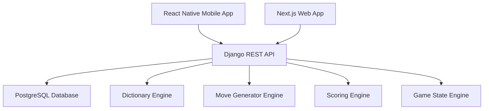
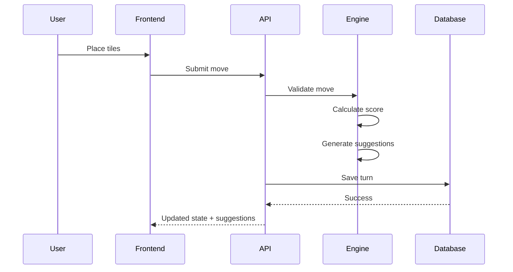

# Architecture.md

# Scrabble AI Assistant — System Architecture

Version: 1.0
Status: MVP Design
Date: July 2, 2026

---

# 1. Overview

Scrabble AI Assistant is an AI-powered move suggestion tool that mirrors real-world Scrabble gameplay.

The application is not primarily a Scrabble game. It is a board-state simulator and assistant that allows users to manually maintain game state while the system computes the best possible moves.

The application supports:

* Web (Desktop + Tablet)
* Mobile (Android + iOS)

Users manually maintain:

* Board state
* Player rack state
* Tile bag state

The AI engine computes:

* Top 5 move suggestions
* Highest immediate score
* Move ranking
* Move validation

---

# 2. High-Level Architecture



---

# 3. Architecture Principles

### Single Source of Truth

Backend maintains:

* game state
* move history
* tile state
* suggestions

Frontend only renders data.

---

### Stateless API

Frontend sends:

Input:

* board state
* rack state
* current player
* game settings

Backend computes:

Output:

* validated move
* updated state
* AI suggestions

---

### Modular AI Engine

AI logic separated into:

1. Dictionary Engine
2. Move Generator
3. Scoring Engine
4. Suggestion Ranking

This prevents coupling AI logic directly with UI.

---

# 4. Technology Stack

## Frontend (Web)

Framework:

* Next.js

Language:

* TypeScript

UI:

* React
* TailwindCSS

Responsibilities:

* Board rendering
* Drag-and-drop tiles
* Game setup
* Replay
* History
* Suggestions panel

---

## Frontend (Mobile)

Framework:

* React Native

Language:

* TypeScript

Responsibilities:

* Mobile board interaction
* Touch controls
* Suggestion viewing
* Game simulation

---

## Backend

Framework:

* Django
* Django REST Framework

Language:

* Python

Responsibilities:

* API endpoints
* Business logic
* Authentication (future)
* Game processing
* AI computations

---

## Database

Database:

* PostgreSQL

Responsibilities:

Store:

* games
* turns
* players
* move history
* replay data
* board states

---

# 5. Core Components

## Game State Engine

Responsible for:

* maintaining board state
* maintaining rack state
* maintaining tile bag state
* player turns
* move history

Input:

```txt
Current game state
```

Output:

```txt
Updated game state
```

---

## Dictionary Engine

Supported dictionaries:

* TWL
* CSW

Responsibilities:

* word lookup
* move validation

Input:

```txt
candidate word
```

Output:

```txt
valid/invalid
```

---

## Move Generator Engine

Responsibilities:

* generate possible words
* find legal placements
* calculate move candidates

Input:

```txt
board state
rack state
```

Output:

```txt
candidate moves
```

---

## Scoring Engine

Responsibilities:

* calculate move score
* apply board multipliers

Includes:

* Double Letter
* Triple Letter
* Double Word
* Triple Word
* Bingo bonus

Output:

```txt
score
```

---

## Suggestion Engine

Responsibilities:

* rank candidate moves
* select top 5 moves

MVP strategy:

Immediate score only

Future:

* rack leave valuation
* defensive play
* board control

Output:

```txt
Top 5 suggestions
```

---

# 6. Request Flow



---

# 7. Folder Structure

```txt
scrabble-ai-assistant/

backend/
│
├── api/
├── game/
├── ai/
├── dictionary/
├── scoring/
├── models/
├── services/
├── utils/

frontend-web/
│
├── components/
├── pages/
├── hooks/
├── services/
├── state/

frontend-mobile/
│
├── components/
├── screens/
├── services/
├── hooks/
├── state/

docs/
│
├── README.md
├── PRD.md
├── Architecture.md
├── Database.md
├── API.md
├── Roadmap.md
│
└── diagrams/
     ├── er.md
     ├── state-flow.md
     └── system.md
```

---

# 8. Future Architecture Expansion

Future features:

* Accounts
* Cloud sync
* Online multiplayer
* Spectator mode
* OCR board scanner
* Camera tile detection
* Stronger AI evaluation
* AI vs Player mode
* Tournament analytics

---

# 9. MVP Constraints

Not included in MVP:

* Online multiplayer
* Authentication
* Friend system
* Chat
* Real-time sync
* Advanced AI heuristics

---

# 10. MVP Success Definition

MVP is considered complete if:

* Users can create a game
* Users can manually maintain board state
* Users can switch between TWL and CSW
* Users can simulate two players
* AI returns top 5 suggestions
* Move history is saved
* Replay works
* Mobile and web function correctly

```
```
