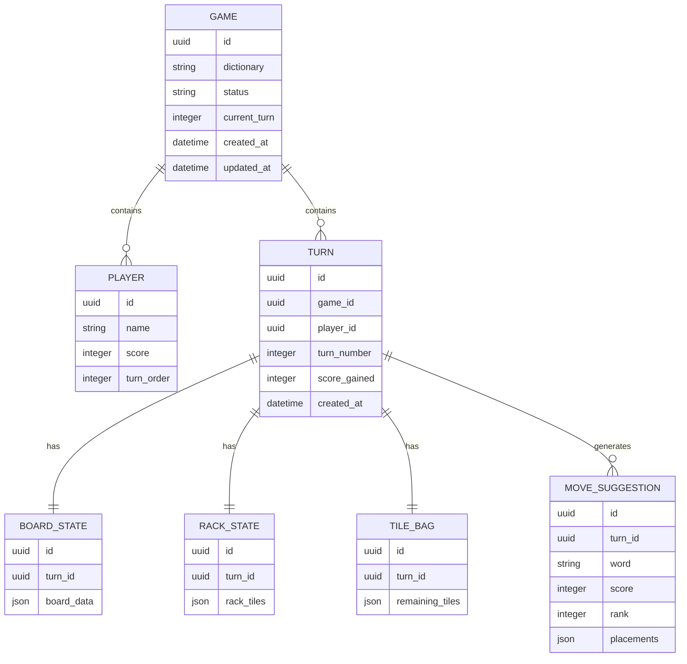
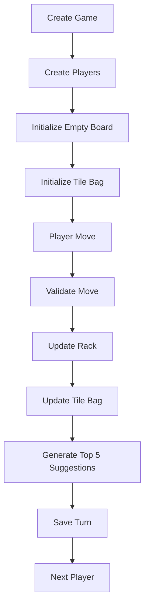

# DatabaseSchema.md

# Scrabble AI Assistant — Database Schema

## Purpose

This document defines the database structure for the Scrabble AI Assistant MVP.

The database must support:

* Game creation
* Two-player local gameplay simulation
* Dictionary selection (TWL / CSW)
* Board state storage
* Rack state storage
* Tile bag tracking
* Move history
* AI suggestions
* Replay/history functionality
* Future scalability for accounts and online multiplayer

Database:

```txt
PostgreSQL
```

Backend ORM:

```txt
Django ORM
```

---

# Entity Relationship Overview



---

# Tables

## GAME

Stores one Scrabble session.

Fields:

| Field        |        Type | Description         |
| ------------ | ----------: | ------------------- |
| id           |        UUID | Primary key         |
| dictionary   | VARCHAR(10) | TWL or CSW          |
| status       | VARCHAR(20) | active/completed    |
| current_turn |     INTEGER | Current turn number |
| created_at   |   TIMESTAMP | Creation date       |
| updated_at   |   TIMESTAMP | Last update         |

Example:

```json
{
"id":"g123",
"dictionary":"TWL",
"status":"active",
"current_turn":5
}
```

---

## PLAYER

Stores players belonging to a game.

Fields:

| Field      | Type         |
| ---------- | ------------ |
| id         | UUID         |
| game_id    | UUID         |
| name       | VARCHAR(100) |
| score      | INTEGER      |
| turn_order | INTEGER      |

Example:

```json
{
"id":"p1",
"name":"Player 1",
"score":88,
"turn_order":1
}
```

---

## TURN

Stores every move cycle.

Fields:

| Field        | Type      |
| ------------ | --------- |
| id           | UUID      |
| game_id      | UUID      |
| player_id    | UUID      |
| turn_number  | INTEGER   |
| score_gained | INTEGER   |
| created_at   | TIMESTAMP |

Example:

```json
{
"turn_number":6,
"score_gained":24
}
```

---

## BOARD_STATE

Stores full board state snapshot.

Board uses a 15×15 matrix.

Example structure:

```json
[
["","","","",""],
["","","A","T",""],
["","","","",""]
]
```

Fields:

| Field      | Type  |
| ---------- | ----- |
| id         | UUID  |
| turn_id    | UUID  |
| board_data | JSONB |

---

## RACK_STATE

Stores current rack of active player.

Example:

```json
["A","E","R","S","N","T","L"]
```

Fields:

| Field      | Type  |
| ---------- | ----- |
| id         | UUID  |
| turn_id    | UUID  |
| rack_tiles | JSONB |

---

## TILE_BAG

Stores remaining tiles.

Example:

```json
{
"A":5,
"B":2,
"C":2,
"D":3
}
```

Fields:

| Field           | Type  |
| --------------- | ----- |
| id              | UUID  |
| turn_id         | UUID  |
| remaining_tiles | JSONB |

---

## MOVE_SUGGESTION

Stores top AI-generated suggestions.

Top 5 suggestions generated per turn.

Fields:

| Field      | Type        |
| ---------- | ----------- |
| id         | UUID        |
| turn_id    | UUID        |
| word       | VARCHAR(30) |
| score      | INTEGER     |
| rank       | INTEGER     |
| placements | JSONB       |

Placement example:

```json
{
"start_row":7,
"start_col":5,
"direction":"horizontal",
"tiles":["T","R","E","E"]
}
```

---

# Dictionary Tables

Dictionary words should not be stored directly inside application code.

Create separate dictionary tables.

## DICTIONARY

Fields:

| Field           | Type    |
| --------------- | ------- |
| id              | UUID    |
| dictionary_type | VARCHAR |
| word            | VARCHAR |
| word_length     | INTEGER |

Examples:

```json
{
"dictionary_type":"TWL",
"word":"HELLO",
"word_length":5
}
```

---

# Suggested Indexes

```sql
CREATE INDEX idx_game_status
ON game(status);

CREATE INDEX idx_turn_game
ON turn(game_id);

CREATE INDEX idx_dictionary_word
ON dictionary(word);

CREATE INDEX idx_move_rank
ON move_suggestion(rank);
```

---

# Future Expansion (Not MVP)

Additional tables:

```txt
USER
FRIEND
MATCHMAKING
ONLINE_GAME
ACHIEVEMENTS
ANALYTICS
SUBSCRIPTIONS
```

---

# Database Flow



---

# MVP Notes

Current design intentionally stores board snapshots rather than move diffs.

Reason:

* Replay becomes easier
* Undo becomes easier
* Debugging becomes easier
* AI testing becomes easier

Potential optimization later:

```txt
Board snapshots → Move delta system
```

if storage becomes large.
