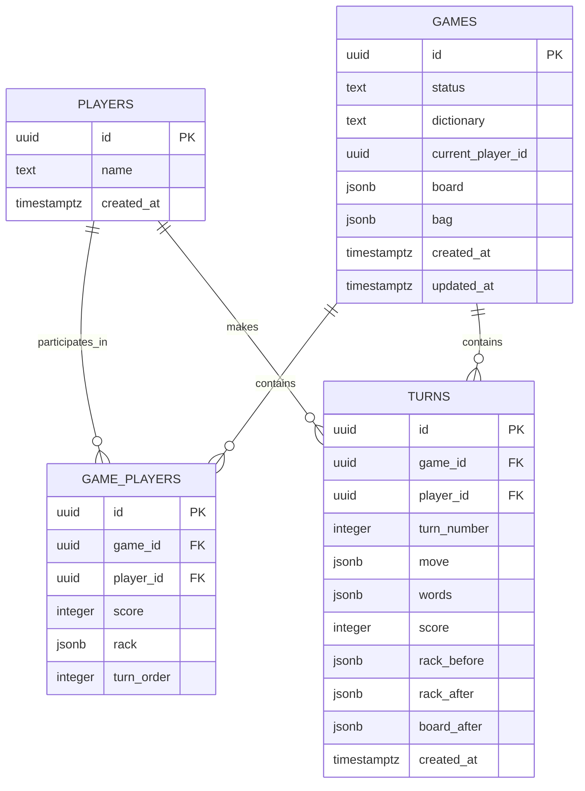
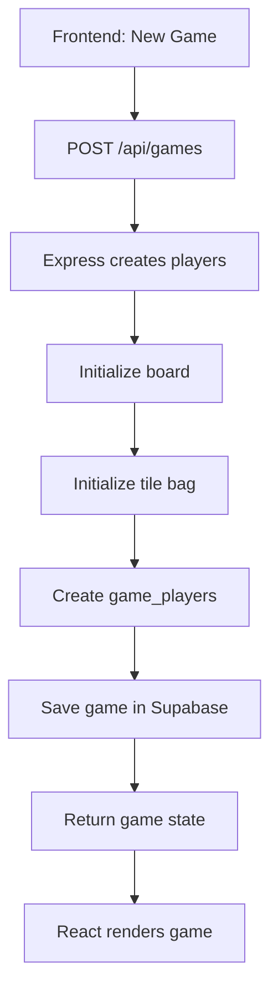
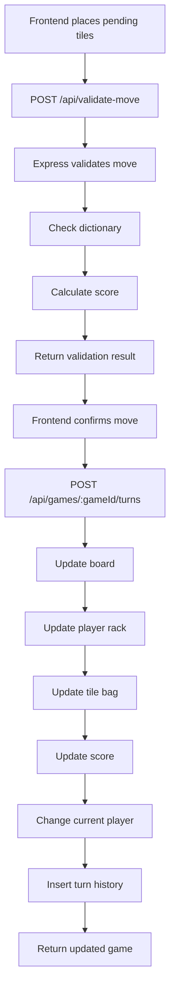

Yes. I would replace the old Django-oriented schema with a **Node/Express + Supabase PostgreSQL** schema, while explicitly separating **persistent game state** from the **static Scrabble configuration currently reused by the frontend**.

Below is the revised `DatabaseSchema.md` you can use as the new source of truth.

# Scrabble AI Assistant — Database Schema

## Purpose

This document defines the persistence structure for the Scrabble AI Assistant MVP.

The application uses:

```text
Frontend
    ↓
Node.js + Express API
    ↓
Supabase PostgreSQL
```

Supabase provides the PostgreSQL database and persistence layer.

The Node/Express backend is responsible for:

- Game creation
- Game state loading/saving
- Player state
- Board state
- Rack state
- Tile bag state
- Turn history
- Move validation
- Scoring
- Dictionary selection
- AI suggestions later

The frontend should no longer own persistent game data.

---

# 1. Technology

## Database

```text
Supabase PostgreSQL
```

## Backend

```text
Node.js
Express
TypeScript
```

## Database Access

Use the Supabase JavaScript client from the Node/Express backend.

```text
Node/Express
    ↓
Supabase JS client
    ↓
PostgreSQL
```

The frontend should communicate with the Express API rather than directly modifying game tables.

```text
React
  ↓
Express API
  ↓
Supabase
```

---

# 2. Core Design

The MVP uses four persistent tables:

```text
players
games
game_players
turns
```

AI suggestions are intentionally excluded from the initial persistence layer.

The relationship is:

```text
players
   │
   │
   ▼
game_players
   │
   ▼
games
   │
   ▼
turns
```

---

# 3. Entity Relationship Diagram


```mermaid
erDiagram

    PLAYERS ||--o{ GAME_PLAYERS : participates_in

    GAMES ||--o{ GAME_PLAYERS : contains

    GAMES ||--o{ TURNS : contains

    PLAYERS ||--o{ TURNS : makes

    PLAYERS {
        uuid id PK
        text name
        timestamptz created_at
    }

    GAMES {
        uuid id PK
        text status
        text dictionary
        uuid current_player_id
        jsonb board
        jsonb bag
        timestamptz created_at
        timestamptz updated_at
    }

    GAME_PLAYERS {
        uuid id PK
        uuid game_id FK
        uuid player_id FK
        integer score
        jsonb rack
        integer turn_order
    }

    TURNS {
        uuid id PK
        uuid game_id FK
        uuid player_id FK
        integer turn_number
        jsonb move
        jsonb words
        integer score
        jsonb rack_before
        jsonb rack_after
        jsonb board_after
        timestamptz created_at
    }
```

---

# 4. `players`

Stores players that participate in games.

For the current MVP, this can contain local/demo players such as:

```text
QwithU
JohnDoe
```

## Fields

| Field      | PostgreSQL Type | Description         |
| ---------- | --------------- | ------------------- |
| id         | uuid            | Primary key         |
| name       | text            | Player display name |
| created_at | timestamptz     | Creation timestamp  |

Example:

```json
{
  "id": "uuid",
  "name": "QwithU",
  "created_at": "2026-09-14T12:00:00Z"
}
```

---

# 5. `games`

Stores the current state of a Scrabble game.

This is the primary game persistence table.

## Fields

| Field             | PostgreSQL Type | Description             |
| ----------------- | --------------- | ----------------------- |
| id                | uuid            | Primary key             |
| status            | text            | Game status             |
| dictionary        | text            | Selected dictionary     |
| current_player_id | uuid            | Player whose turn it is |
| board             | jsonb           | Current board           |
| bag               | jsonb           | Remaining tile bag      |
| created_at        | timestamptz     | Creation timestamp      |
| updated_at        | timestamptz     | Last update             |

Example:

```json
{
  "id": "game-uuid",
  "status": "active",
  "dictionary": "CSW",
  "current_player_id": "player-uuid",
  "board": {},
  "bag": {},
  "created_at": "2026-09-14T12:00:00Z",
  "updated_at": "2026-09-14T12:05:00Z"
}
```

## `status`

Initial values:

```text
active
completed
```

Additional states can be added later if required.

## `dictionary`

Use the backend's existing dictionary identifiers.

For example:

```text
UK
US
```

The exact values should match the current backend dictionary initialization.

---

# 6. `games.board`

The board should be stored as JSONB.

Do not create 225 database rows for the 15×15 board.

The current frontend already represents board positions using keys such as:

```text
"7,5"
"7,6"
"7,7"
```

The persisted representation can therefore remain close to the frontend structure.

Example:

```json
{
  "7,5": {
    "letter": "W",
    "points": 4
  },
  "7,6": {
    "letter": "O",
    "points": 1
  },
  "7,7": {
    "letter": "R",
    "points": 1
  }
}
```

This keeps the database compatible with the current board model without introducing unnecessary tables.

---

# 7. `games.bag`

Stores the current remaining tile bag.

Example:

```json
{
  "A": 7,
  "B": 2,
  "C": 2,
  "D": 4,
  "E": 10,
  "Q": 0,
  "?": 1
}
```

Important distinction:

```text
standardTileDistribution
        ↓
static application configuration

games.bag
        ↓
current game state
```

The database stores only the current remaining bag.

The standard Scrabble distribution remains in backend code.

---

# 8. `game_players`

Connects players to games and stores player-specific game state.

This replaces the frontend's separate concepts such as:

```text
rack
opponentRack
score
turn
```

## Fields

| Field      | PostgreSQL Type | Description            |
| ---------- | --------------- | ---------------------- |
| id         | uuid            | Primary key            |
| game_id    | uuid            | Foreign key to games   |
| player_id  | uuid            | Foreign key to players |
| score      | integer         | Current game score     |
| rack       | jsonb           | Current player's rack  |
| turn_order | integer         | Player order           |

Example:

```json
{
  "id": "uuid",
  "game_id": "game-uuid",
  "player_id": "player-uuid",
  "score": 301,
  "rack": [
    {
      "id": "A-0",
      "letter": "A",
      "points": 1
    },
    {
      "id": "?-6",
      "letter": "?",
      "points": 0,
      "wildcard": true
    }
  ],
  "turn_order": 1
}
```

---

# 9. Rack Representation

The rack should remain JSONB because the frontend's tile model contains more information than a simple letter.

For example:

```json
[
  {
    "id": "A-0",
    "letter": "A",
    "points": 1
  },
  {
    "id": "?-6",
    "letter": "?",
    "points": 0,
    "wildcard": true
  }
]
```

This preserves the current frontend tile structure.

There is therefore no need for a separate `tiles` table in the MVP.

---

# 10. `turns`

Stores every completed move.

The existing frontend `moveHistory` should eventually be generated from this table rather than maintained as permanent static data.

## Fields

| Field       | PostgreSQL Type | Description            |
| ----------- | --------------- | ---------------------- |
| id          | uuid            | Primary key            |
| game_id     | uuid            | Foreign key to games   |
| player_id   | uuid            | Player making the move |
| turn_number | integer         | Sequential turn number |
| move        | jsonb           | Move details           |
| words       | jsonb           | Words formed           |
| score       | integer         | Score gained           |
| rack_before | jsonb           | Rack before move       |
| rack_after  | jsonb           | Rack after move        |
| board_after | jsonb           | Board after move       |
| created_at  | timestamptz     | Turn timestamp         |

---

# 11. `turns.move`

Stores the details of the move.

Example:

```json
{
  "direction": "horizontal",
  "start": {
    "row": 7,
    "col": 5
  },
  "tiles": [
    {
      "letter": "W",
      "row": 7,
      "col": 5
    },
    {
      "letter": "O",
      "row": 7,
      "col": 6
    },
    {
      "letter": "R",
      "row": 7,
      "col": 7
    }
  ]
}
```

The exact structure should remain compatible with the backend move/validation contract.

---

# 12. `turns.words`

A single Scrabble move can create multiple words.

Therefore this should not be a single `word` column.

Example:

```json
["WORDS", "WORD", "OR"]
```

This corresponds to the backend validation result:

```text
words
invalidWords
```

and allows the turn history to preserve the result of the completed move.

---

# 13. `turns.rack_before`

Stores the player's rack before the move.

Example:

```json
[
  {
    "id": "W-1",
    "letter": "W",
    "points": 4
  },
  {
    "id": "O-1",
    "letter": "O",
    "points": 1
  }
]
```

---

# 14. `turns.rack_after`

Stores the player's rack after the move and tile replenishment.

This makes replay/debugging easier and provides a clear historical record.

---

# 15. `turns.board_after`

Stores the board after the completed move.

Example:

```json
{
  "7,5": {
    "letter": "W",
    "points": 4
  },
  "7,6": {
    "letter": "O",
    "points": 1
  }
}
```

The current board remains available from:

```text
games.board
```

while historical boards remain available from:

```text
turns.board_after
```

---

# 16. Static Frontend Data

The current frontend contains several pieces of static Scrabble configuration and demo data.

These should NOT all become database tables.

The correct separation is:

```text
STATIC CONFIGURATION
        ↓
backend code

GAME STATE
        ↓
Supabase

UI PROJECTIONS
        ↓
frontend
```

---

# 17. `tilePoints`

Current static data:

```text
tilePoints
```

Keep this in backend code.

Reason:

```text
A = 1
B = 3
C = 3
...
```

This is game configuration, not game state.

The backend scoring engine already owns this responsibility.

---

# 18. `standardTileDistribution`

Current static data:

```text
standardTileDistribution
```

Keep this in backend code.

This defines the starting Scrabble tile set.

The database only stores:

```text
games.bag
```

which represents the remaining tiles for a specific game.

---

# 19. `premiumMap`

Current static data:

```text
premiumMap
```

Keep this in backend code.

The premium board layout is fixed configuration.

Do not create a database row for every premium square.

The scoring engine should use the existing backend premium configuration.

---

# 20. `seededTiles`

The current frontend contains seeded board tiles.

These should no longer be treated as permanent game data.

For a newly created game:

```text
board = {}
```

The board starts empty.

Any test/demo position should be created through:

```text
test data
```

or:

```text
game creation / development seed
```

rather than being permanently embedded in the production frontend.

---

# 21. `rack` and `opponentRack`

Current frontend:

```text
rack
opponentRack
```

These should not remain as independent static values.

They become:

```text
game_players.rack
```

The frontend determines which rack belongs to the current player.

Conceptually:

```text
game_players
       ↓
 ┌──────────────┐
 │ QwithU       │
 │ rack         │
 │ score        │
 └──────────────┘

 ┌──────────────┐
 │ JohnDoe      │
 │ rack         │
 │ score        │
 └──────────────┘
```

---

# 22. `moveHistory`

Current frontend:

```text
moveHistory
```

becomes:

```text
turns
```

The frontend should eventually receive move history from:

```text
GET /api/games/:gameId
```

or:

```text
GET /api/games/:gameId/turns
```

rather than maintaining permanent mock history.

---

# 23. `suggestions`

Current static suggestions should NOT be persisted yet.

For example:

```text
RELATION
ORIENTAL
TREASON
LEARN
LATER
```

These are AI output.

For the MVP:

```text
AI engine
    ↓
suggestions
    ↓
API response
    ↓
frontend
```

If persistent AI suggestions are required later, introduce:

```text
game_suggestions
```

without changing the core game schema.

---

# 24. `GameSummary`

`GameSummary` is a frontend/API representation, not a database table.

The frontend may have:

```ts
GameSummary;
```

containing:

```text
id
opponent
opponentInitial
score
turn
updated
progress
```

This should be constructed by the Express API from:

```text
games
+
game_players
+
turns
```

Example:

```text
Supabase
    ↓
Express
    ↓
GameSummary[]
    ↓
React
```

Do not create:

```text
game_summaries
```

---

# 25. Static Data → New Location

| Current Data               | New Location                          |
| -------------------------- | ------------------------------------- |
| `tilePoints`               | Backend game configuration            |
| `standardTileDistribution` | Backend game configuration            |
| `premiumMap`               | Backend game configuration            |
| `rack`                     | `game_players.rack`                   |
| `opponentRack`             | `game_players.rack`                   |
| `score`                    | `game_players.score`                  |
| `games` mock data          | `games` + `game_players`              |
| `seededTiles`              | Removed from production initial state |
| `moveHistory`              | `turns`                               |
| `suggestions`              | Dynamic AI output later               |
| `GameSummary`              | Express API response                  |
| `board`                    | `games.board`                         |
| `remaining tiles`          | `games.bag`                           |
| `current turn`             | `games.current_player_id`             |

---

# 26. SQL Schema

The initial Supabase migration should create the following tables.

```sql
create table players (
    id uuid primary key default gen_random_uuid(),
    name text not null,
    created_at timestamptz not null default now()
);

create table games (
    id uuid primary key default gen_random_uuid(),
    status text not null default 'active',
    dictionary text not null,
    current_player_id uuid,
    board jsonb not null default '{}'::jsonb,
    bag jsonb not null default '{}'::jsonb,
    created_at timestamptz not null default now(),
    updated_at timestamptz not null default now(),

    constraint games_current_player_fk
        foreign key (current_player_id)
        references players(id)
);

create table game_players (
    id uuid primary key default gen_random_uuid(),
    game_id uuid not null references games(id) on delete cascade,
    player_id uuid not null references players(id) on delete cascade,
    score integer not null default 0,
    rack jsonb not null default '[]'::jsonb,
    turn_order integer not null,

    unique (game_id, player_id),
    unique (game_id, turn_order)
);

create table turns (
    id uuid primary key default gen_random_uuid(),
    game_id uuid not null references games(id) on delete cascade,
    player_id uuid not null references players(id),
    turn_number integer not null,
    move jsonb not null,
    words jsonb not null default '[]'::jsonb,
    score integer not null default 0,
    rack_before jsonb not null,
    rack_after jsonb not null,
    board_after jsonb not null,
    created_at timestamptz not null default now(),

    unique (game_id, turn_number)
);
```

---

# 27. Indexes

Start with only the indexes needed for normal game access.

```sql
create index idx_games_status
on games(status);

create index idx_game_players_game
on game_players(game_id);

create index idx_turns_game
on turns(game_id);

create index idx_turns_player
on turns(player_id);
```

Do not prematurely index JSONB fields.

---

# 28. Backend Responsibility

The Node/Express backend owns game rules and persistence orchestration.

```text
Express route
      ↓
Game service
      ↓
Game rules
      ↓
Dictionary
      ↓
Scoring
      ↓
Supabase
```

The frontend should not directly calculate the authoritative game state.

---

# 29. Frontend Responsibility

The React frontend owns presentation and temporary interaction state.

For example:

```text
pending tiles
selected tile
selected player
UI state
loading state
validation display
```

Persistent state comes from the API:

```text
board
rack
scores
bag
turn
history
game metadata
```

---

# 30. Persistence Flow

Creating a game:


```mermaid
flowchart TD

A[Frontend: New Game]
--> B[POST /api/games]

B
--> C[Express creates players]

C
--> D[Initialize board]

D
--> E[Initialize tile bag]

E
--> F[Create game_players]

F
--> G[Save game in Supabase]

G
--> H[Return game state]

H
--> I[React renders game]
```

---

# 31. Playing a Turn


```mermaid
flowchart TD

A[Frontend places pending tiles]
--> B[POST /api/validate-move]

B
--> C[Express validates move]

C
--> D[Check dictionary]

D
--> E[Calculate score]

E
--> F[Return validation result]

F
--> G[Frontend confirms move]

G
--> H[POST /api/games/:gameId/turns]

H
--> I[Update board]

I
--> J[Update player rack]

J
--> K[Update tile bag]

K
--> L[Update score]

L
--> M[Change current player]

M
--> N[Insert turn history]

N
--> O[Return updated game]
```

---

# 32. Important API Boundary

Validation and persistence are separate responsibilities.

Validation:

```text
POST /api/validate-move
```

answers:

```text
Is this move valid?
What words were formed?
What score would it produce?
```

Persistence:

```text
POST /api/games/:gameId/turns
```

answers:

```text
Save this completed move.
Update the game state.
```

This allows the existing validation system to remain useful while persistence is added.

---

# 33. Loading a Game

The frontend should eventually stop loading static game data.

Instead:

```text
GET /api/games/:gameId
```

returns the current persisted game.

Conceptually:

```json
{
  "id": "game-uuid",
  "status": "active",
  "dictionary": "UK",
  "currentPlayerId": "player-uuid",
  "board": {},
  "players": [
    {
      "id": "player-uuid",
      "name": "QwithU",
      "score": 301,
      "rack": []
    },
    {
      "id": "player-uuid",
      "name": "JohnDoe",
      "score": 312,
      "rack": []
    }
  ],
  "turns": []
}
```

The exact API response can be shaped for the existing frontend types.

---

# 34. Migration Strategy

Do not replace all static frontend data at once.

Implement persistence in small steps.

## Step 1 — Database

Create:

```text
players
games
game_players
turns
```

in Supabase.

---

## Step 2 — Supabase Connection

Add Supabase configuration to Node/Express.

```text
SUPABASE_URL
SUPABASE_SERVICE_ROLE_KEY
```

The service-role key remains server-side only.

---

## Step 3 — Game Creation

Implement:

```text
POST /api/games
```

Create:

```text
game
players
game_players
initial board
initial bag
```

---

## Step 4 — Game Loading

Implement:

```text
GET /api/games/:gameId
```

Replace the frontend's static game object with the API response.

---

## Step 5 — Save Turn

Implement:

```text
POST /api/games/:gameId/turns
```

After a valid move:

```text
board
rack
bag
score
current player
turn history
```

are updated.

---

## Step 6 — Replace Static History

Replace:

```text
moveHistory
```

with:

```text
GET /api/games/:gameId/turns
```

or include turns in the game response.

---

## Step 7 — Remove Static Game State

Once the API is working, remove production dependencies on:

```text
mockGames
seededTiles
static racks
static scores
static moveHistory
```

Keep static Scrabble configuration.

---

# 35. What Remains Static

The final architecture should intentionally keep these in code:

```text
tilePoints
standardTileDistribution
premiumMap
Scrabble rules
dictionary files
scoring rules
```

These are application/game rules.

Supabase stores:

```text
players
games
game_players
turns
```

These are persistent game state.

---

# 36. MVP Database Boundary

The MVP should therefore remain intentionally small:

```text
                 NODE / EXPRESS
                       │
          ┌────────────┼────────────┐
          │            │            │
       Rules       Dictionary    Scoring
          │            │            │
          └────────────┼────────────┘
                       │
                    Supabase
                       │
          ┌────────────┼────────────┐
          │            │            │
       players       games     game_players
                       │
                       │
                     turns
```

No separate tables are required yet for:

```text
board squares
tiles
tile definitions
premiums
suggestions
game summaries
dictionary words
AI results
users
friends
matchmaking
analytics
```

The existing backend dictionary files remain application resources for now.

---

# 37. Future Expansion

Only add these when the feature actually exists:

```text
users
game_suggestions
online_games
friends
achievements
analytics
subscriptions
```

The core four-table model should remain the foundation.

---

# 38. Final Source-of-Truth Model

The Scrabble application should follow this rule:

```text
                    ┌─────────────────────┐
                    │   STATIC CONFIG      │
                    │                     │
                    │ tilePoints          │
                    │ tileDistribution    │
                    │ premiumMap          │
                    │ dictionary files    │
                    │ game rules          │
                    └──────────┬──────────┘
                               │
                               ▼
                        NODE / EXPRESS
                               │
                               ▼
                    ┌─────────────────────┐
                    │      SUPABASE       │
                    │                     │
                    │ players             │
                    │ games               │
                    │ game_players       │
                    │ turns               │
                    └──────────┬──────────┘
                               │
                               ▼
                         FRONTEND
                               │
                    ┌──────────┴──────────┐
                    │                     │
              persistent state       UI state
                    │                     │
              board/rack/bag          pending tiles
              scores/turns            selections
```

The key principle is:

> **Static Scrabble rules stay in the Node backend. Persistent game state goes to Supabase. The React frontend consumes the Express API and keeps only temporary UI state locally.**

This is the version I would use going forward. The **big change from the old document** is that we are no longer designing around Django models; we're designing around **PostgreSQL tables + Supabase + a thin Node/Express persistence layer**, while preserving the data shapes your current frontend already uses.
