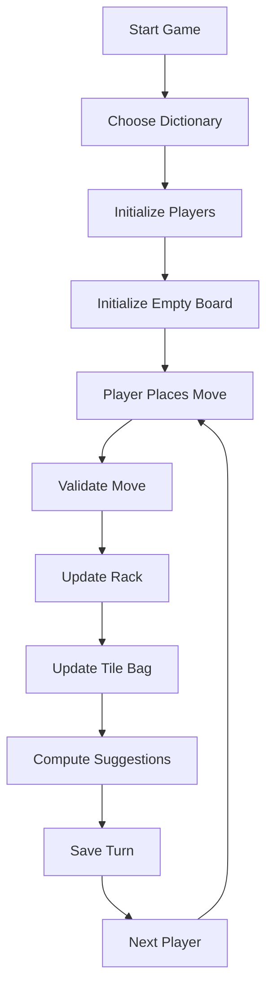

# Product Requirements Document (PRD)

# Scrabble AI Assistant

Version: 1.0 MVP
Status: In Development
Date: July 2, 2026

---

# 1. Product Overview

Scrabble AI Assistant is an AI-powered move suggestion application designed to help players during real-world Scrabble gameplay.

The application is not intended to replace the actual board game. Instead, it functions as a companion tool where users manually maintain game state and receive intelligent move suggestions.

The system simulates a complete Scrabble environment by tracking:

* Board state
* Player racks
* Tile bag
* Scores
* Move history
* Turn history

The AI engine computes and recommends the top five possible moves based on the current state.

The MVP supports local two-player gameplay simulation within one device.

Supported platforms:

* Desktop web
* Mobile web
* Android application
* iOS application

---

# 2. Problem Statement

Scrabble players often experience difficulty:

* Finding optimal word placements
* Tracking remaining tiles
* Calculating future opportunities
* Remembering move history
* Managing game state manually

Competitive players may also want assistance during practice and analysis.

Current tools often focus on word finding only and do not simulate complete game state accurately.

---

# 3. Proposed Solution

Provide a Scrabble assistant that mirrors a real game environment.

Users manually manage:

* Existing board letters
* Current rack letters
* Drawn tiles
* Player turns

The system automatically:

* Validates moves
* Updates scores
* Tracks tile bag status
* Saves move history
* Computes top move suggestions

---

# 4. Target Users

## Primary Users

### Casual Players

Players seeking help while playing with friends or family.

Goals:

* Better move suggestions
* Easier score tracking

---

### Competitive Players

Players preparing for tournaments.

Goals:

* Study optimal moves
* Practice strategy

---

### Tournament Players

Advanced users requiring accurate simulation.

Goals:

* Analyze games
* Improve performance

---

# 5. Product Goals

Primary goals:

* Deliver accurate move suggestions
* Simulate real Scrabble game state
* Support multiple dictionaries
* Maintain game history

Secondary goals:

* Cross-platform support
* Fast suggestion generation
* Replay previous games

---

# 6. Success Metrics

MVP success indicators:

### Performance

AI suggestion generation:

* Less than 3 seconds average response time

Move validation:

* Less than 500 milliseconds

---

### Usage

* Average session length >10 minutes
* Multiple games played per user session
* Replay feature usage

---

### Quality

* Move validation accuracy: 100%
* Dictionary lookup accuracy: 100%

---

# 7. MVP Features

## 7.1 Game Setup

Users can:

* Start a new game
* Select dictionary
* Initialize players

Available dictionaries:

* TWL
* CSW

Dictionary selection is locked after game creation.

---

## 7.2 Two Player Local Simulation

Initial MVP:

* Two players
* Same device
* Turn-by-turn play

Flow:

Player 1 Turn

↓

Player 2 Turn

↓

Repeat

---

## 7.3 Board Management

Board specifications:

* 15x15 board

Features:

* Tap-to-place letters
* Drag-and-drop tiles
* Remove placed tiles
* Highlight premium squares

Special tiles:

* Double Letter
* Triple Letter
* Double Word
* Triple Word

---

## 7.4 Rack Management

Each player has:

* Seven rack slots

Features:

* Add letters
* Remove letters
* Reorder letters
* Replace letters manually

---

## 7.5 Tile Bag Tracking

System tracks:

* Remaining letters
* Remaining quantities
* Used tiles

Tile bag updates after:

* Move completion
* Tile draw

---

## 7.6 Move Validation

System validates:

* Word existence
* Letter placement rules
* Board connectivity
* Tile availability
* Cross-word validity

Invalid moves return errors.

---

## 7.7 AI Suggestion Engine

AI computes:

Top 5 move recommendations.

Each suggestion includes:

* Word
* Position
* Direction
* Score
* Tiles used

Ranking:

Highest immediate score first.

Future versions may include:

* Strategic evaluation
* Defensive play
* Endgame calculations

---

## 7.8 Move History

Store:

* Turn number
* Player
* Word played
* Score gained
* Rack used

---

## 7.9 Replay System

Users can:

* Replay moves sequentially
* Move forward
* Move backward
* Jump to specific turns

---

## 7.10 Score Tracking

Track:

Player score

Player cumulative score

Turn score history

---

# 8. Non-Functional Requirements

## Performance

Suggestion generation:

<3 seconds

Board updates:

<100 milliseconds

---

## Reliability

* No data loss during gameplay
* Save game state automatically

---

## Scalability

Architecture should support:

* Accounts
* Cloud sync
* Multiplayer

in future releases

---

## Responsiveness

Must support:

Desktop

Tablet

Mobile

---

# 9. Technical Requirements

Frontend Web:

* Next.js

Frontend Mobile:

* React Native

Backend:

* Django REST Framework

Database:

* PostgreSQL

Dictionary Engine:

* TWL word list
* CSW word list

Future optimization:

* Trie structure
* Indexed search
* Cached move generation

---

# 10. User Flow

---

# 11. Out of Scope (MVP)

The following are intentionally excluded:

### Multiplayer online play

### User accounts

### Authentication

### Friends system

### Chat system

### Cloud synchronization

### AI strategic valuation

### Tournament matchmaking

### Voice input

### Camera OCR board scanning

### Multiplayer across devices

---

# 12. Risks

## Large search space

Challenge:

Generating all legal moves can become computationally expensive.

Mitigation:

* Trie dictionary structures
* Caching
* Incremental board computation

---

## State synchronization complexity

Challenge:

Board state, rack state, and tile bag state must always remain consistent.

Mitigation:

* Centralized game state model
* Turn validation pipeline

---

# 13. Future Features

Version 2+

* Account system
* Online multiplayer
* Cloud save
* AI strategy engine
* Board OCR scanning
* Voice commands
* Statistical analysis
* Endgame solver
* Tournament mode
* Puzzle mode

---

End of PRD
