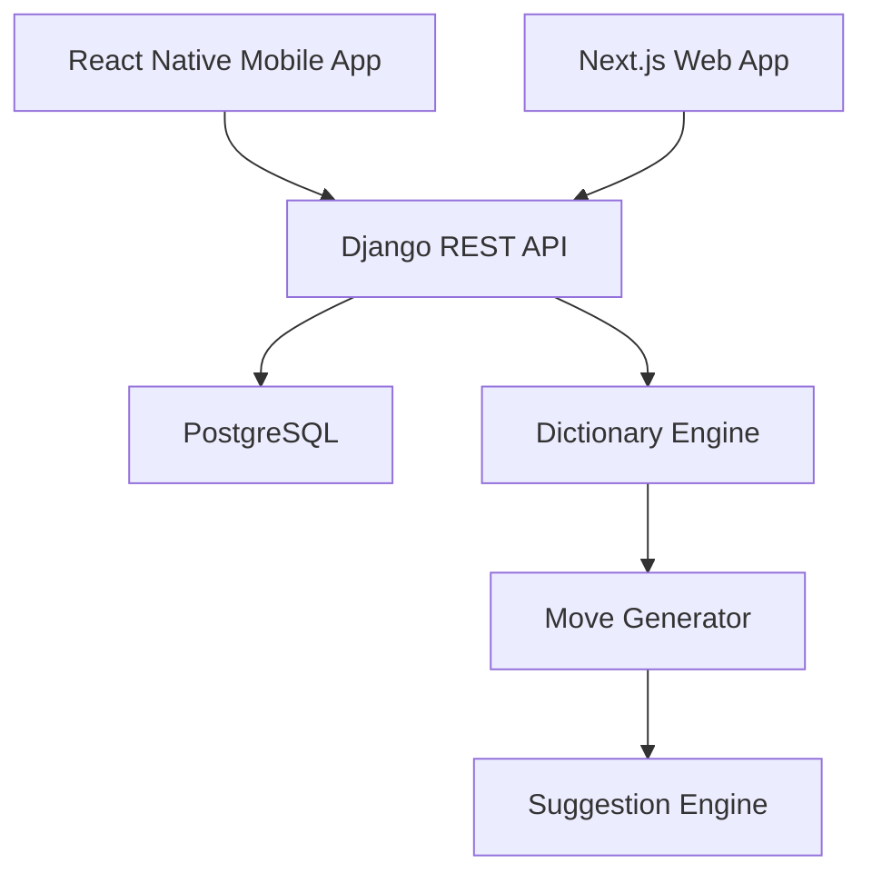
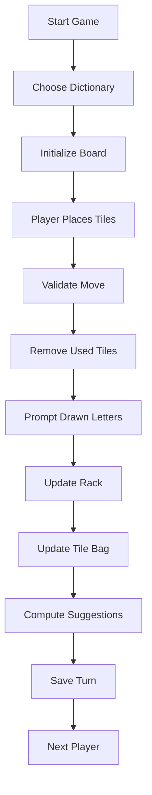

# Scrabble AI Assistant

An AI-powered Scrabble move suggestion application that mirrors real-world gameplay while acting as a companion assistant rather than a standalone Scrabble game.

The application allows users to manually maintain the game state while the AI analyzes the board and suggests the strongest available moves.

---

## Overview

Scrabble AI Assistant is designed for players who are playing physical or simulated Scrabble games and want intelligent move recommendations.

Instead of replacing the game itself, the application works as a support tool.

Users maintain:

* Board state
* Player rack state
* Tile bag state
* Turn state

The system computes:

* Top 5 move suggestions
* Highest immediate score recommendations
* Valid word placements
* Tile usage tracking
* Move history
* Replay history

The game simulation exists only to ensure that the AI calculations remain accurate.

---

# Goals

The application aims to:

* Help players discover stronger moves
* Simulate real-world Scrabble accurately
* Track game progress automatically
* Support multiple dictionary standards
* Provide a clean experience on desktop, mobile, and web

---

# Target Users

### Casual Players

Players learning Scrabble strategy and vocabulary.

### Competitive Players

Players wanting stronger move recommendations.

### Tournament Players

Players needing support using different official dictionaries.

---

# MVP Features

## Game Setup

* Start new game
* Two-player local gameplay
* Single device play
* Choose dictionary before game starts
* Initialize board state
* Initialize tile bag state

---

## Dictionary Support

Available dictionaries:

* TWL (Tournament Word List)
* CSW (Collins Scrabble Words)

Dictionary selection occurs before game creation.

Once selected:

* Entire game uses one dictionary only
* Validation follows chosen dictionary rules
* Suggestions only use chosen dictionary

---

## Board Features

* Standard 15×15 Scrabble board

* Drag-and-drop tile placement

* Manual tile placement support

* Board validation

* Premium tile support:

  * Double Letter
  * Triple Letter
  * Double Word
  * Triple Word

* Highlight newly placed tiles

---

## Player Features

Each player has:

* Rack
* Score
* Move history
* Turn order

Initial MVP:

* Player 1
* Player 2
* Shared device play

---

## AI Suggestion Engine

AI computes:

* Top 5 possible moves
* Immediate score ranking
* Word placement coordinates
* Tile usage

Each suggestion includes:

* Word
* Score
* Starting coordinate
* Direction
* Tiles used

Example:

1.

Word:

QUIZ

Score:

52

Position:

H8

Direction:

Horizontal

Used Tiles:

Q U I Z

---

2.

Word:

JAZZ

Score:

48

Position:

G7

Direction:

Vertical

Used Tiles:

J A Z Z

---

## Move Validation

Before accepting a move:

System validates:

* Word exists
* Connected placement
* Tile ownership
* Premium score rules
* Board legality
* Dictionary legality

---

## Tile Tracking

The system tracks:

### Player rack

Current player letters

Example:

A D I O N T R

### Tile bag

Remaining unseen tiles

Example:

Remaining:

* A × 5
* E × 8
* Z × 1

### Used tiles

Letters already played

---

## Turn Flow

Turn sequence:

1. Player places tiles

2. Move validation

3. Score calculation

4. Remove used tiles

5. Prompt newly drawn letters

6. Update rack

7. Update tile bag

8. Compute AI suggestions

9. Save turn

10. Switch player

---

# Replay and History

The system stores:

* Move history
* Score history
* Board states
* Rack states
* Suggestions generated

Replay allows:

* Move-by-move navigation
* Previous board restoration
* Review of decisions

---

# Future Features (Post MVP)

Potential future improvements:

### Multiplayer Online

* User accounts
* Matchmaking
* Friends list

### Advanced AI Evaluation

Beyond immediate score:

* Rack leave analysis
* Defensive play
* Future board valuation
* Tile probability analysis
* Endgame strategy

### OCR Support

Potential features:

* Capture physical Scrabble board using camera
* Detect letters automatically
* Import board state

### AI Coaching

Potential recommendations:

* Explain why move was chosen
* Show better alternatives
* Teach strategy

---

# Out of Scope (MVP)

The MVP will NOT include:

* Online multiplayer
* Authentication
* Social features
* Chat
* Tournament mode
* AI opponent
* Camera board recognition
* Advanced strategic evaluation

---

# Technology Stack

## Frontend Web

* Next.js
* React
* TypeScript

---

## Mobile

* React Native

---

## Backend

* Django
* Django REST Framework

---

## Database

* PostgreSQL

---

## AI / Game Engine

Components:

* Dictionary engine
* Move generator
* Board validator
* Scoring engine
* Suggestion engine

---

# Proposed Project Structure

```txt
scrabble-ai-assistant/

├── backend/
│   ├── api/
│   ├── game_engine/
│   ├── dictionary/
│   ├── suggestions/
│   └── models/
│
├── frontend-web/
│   ├── components/
│   ├── pages/
│   ├── hooks/
│   └── services/
│
├── frontend-mobile/
│   ├── screens/
│   ├── components/
│   └── services/
│
├── docs/
│   ├── PRD.md
│   ├── Architecture.md
│   ├── Database.md
│   ├── API.md
│   ├── Roadmap.md
│   │
│   └── diagrams/
│       ├── er.md
│       ├── system.md
│       └── state-flow.md
│
└── README.md
```

---

# System Architecture



---

# State Flow



---

# Planned API Endpoints

```txt
POST /games/create

POST /games/{id}/move

POST /games/{id}/suggest

GET /games/{id}/history

GET /games/{id}/replay

GET /games/{id}/board

GET /games/{id}/rack

GET /games/{id}/scores
```

---

# MVP Roadmap

## Phase 1

Foundation

* Database setup
* Dictionary import
* Game models

---

## Phase 2

Board Interface

* Board UI
* Drag-and-drop
* Tile placement

---

## Phase 3

Game Logic

* Move validation
* Score calculation
* Tile tracking

---

## Phase 4

AI Suggestion Engine

* Move generation
* Top 5 suggestions
* Score ranking

---

## Phase 5

History System

* Replay
* Move history
* Score history

---

## Phase 6

Cross Platform Deployment

* Web application
* Android application
* iOS application

---

# Current Status

Status:

MVP in development

Current focus:

* Product definition
* Architecture planning
* Documentation creation

---

# License

To be determined
