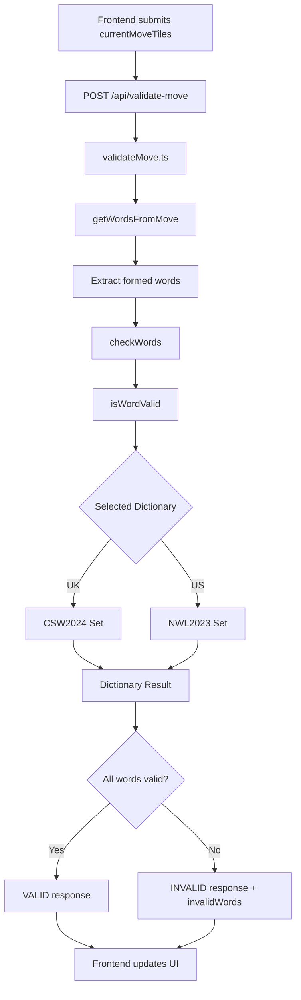
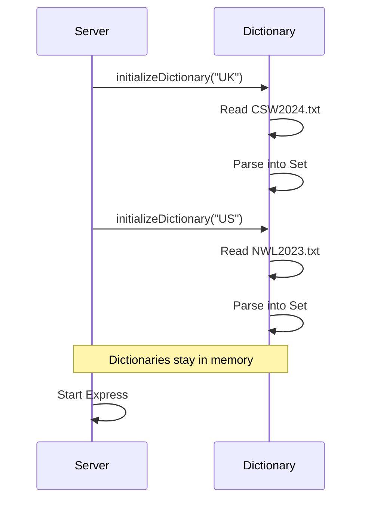
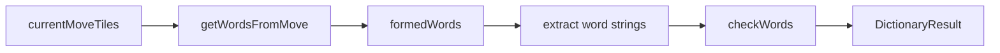
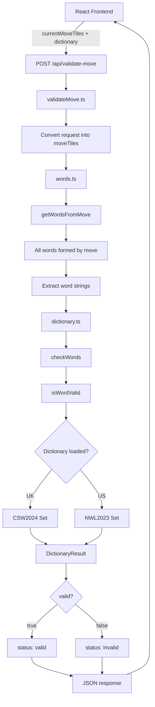

Yes. Based on the three files you provided, the implementation is already structurally close. The missing piece is mainly **finishing the validation response and making the word-extraction → dictionary-check pipeline explicit and testable**.

## Implementation Plan

### Target flow



---

# 1. `words.ts` — Produce the words

**First implementation target:**

```text
currentMoveTiles
        ↓
getWordsFromMove()
        ↓
[
  { word: "ES", ... },
  { word: "OR", ... },
  { word: "AEO", ... }
]
```

The important responsibility of `words.ts` is:

> **Determine what words the current move creates.**

It should **not** decide whether those words are legal dictionary words.

### Expected output

For example:

```ts
[
  { word: "ES", ... },
  { word: "OR", ... },
  { word: "AEO", ... }
]
```

Then `validateMove.ts` can simply extract:

```ts
const words = formedWords.map(({ word }) => word);
```

---

# 2. `dictionary.ts` — Check whether words exist

You already have this architecture:

```text
Dictionary file
     ↓
parseUS / parseUK
     ↓
Set<string>
     ↓
initializeDictionary()
     ↓
isWordValid()
     ↓
checkWords()
```

The two dictionary formats are handled independently:

```text
NWL2023.txt
     ↓
parseUS()

CSW2024.txt
     ↓
parseUK()
```

Both eventually become:

```ts
Set<string>;
```

That is good because the rest of the application doesn't need to care about the original file format.

### Expected contract

Input:

```ts
checkWords("UK", ["ES", "OR", "AEO"]);
```

Output:

```ts
{
  valid: false,
  invalidWords: ["AEO"],
  dictionary: "UK"
}
```

---

# 3. `server.ts` — Initialize dictionaries once

You already do this:

```ts
initializeDictionary("UK");
initializeDictionary("US");
```

This happens when the server starts.

So the intended lifecycle is:



This means you **do not reload the 60MB-ish dictionary file for every move**.

That is exactly what you want.

---

# 4. `validateMove.ts` — Connect the pipeline

This is currently the central pipeline:

```ts
const formedWords = getWordsFromMove(moveTiles);

const words = formedWords.map(({ word }) => word);

const result = checkWords(selectedDictionary, words);
```

Conceptually:



So `validateMove.ts` acts as the **orchestrator**.

It should not contain dictionary parsing logic.

It should not contain word-extraction logic.

It coordinates the two.

---

# 5. Finish the HTTP response

This is currently commented out:

```ts
// res.json({
//   status: result.valid ? "valid" : "invalid",
//   words: formedWords,
//   invalidWords: result.invalidWords,
//   dictionary: result.dictionary,
// });
```

This should become the actual API response.

The frontend then receives something conceptually like:

### Valid

```json
{
  "status": "valid",
  "words": [{ "word": "ES" }, { "word": "OR" }],
  "invalidWords": [],
  "dictionary": "UK"
}
```

### Invalid

```json
{
  "status": "invalid",
  "words": [{ "word": "ES" }, { "word": "AEO" }],
  "invalidWords": ["AEO"],
  "dictionary": "UK"
}
```

---

# 6. Complete end-to-end architecture

The final backend flow should be:



---

# 7. Implementation order

I would execute it in this exact order:

```text
1. words.ts
   ↓
   Make sure every word created by currentMoveTiles is correctly extracted.

2. dictionary.ts
   ↓
   Verify UK + US parsing and dictionary lookup.

3. validateMove.ts
   ↓
   Connect words.ts → dictionary.ts.

4. Return JSON response
   ↓
   Remove the commented res.json() and make the API actually respond.

5. Test API
   ↓
   Valid word → valid
   Invalid word → invalid
   Multiple words → all checked
   Mixed valid/invalid → invalidWords populated

6. Connect frontend
   ↓
   Frontend receives backend result.

7. UI validation
   ↓
   valid → green
   invalid → red
```

---

## The key architectural idea

Your backend is becoming:

```text
             validateMove.ts
                    │
          ┌─────────┴─────────┐
          ↓                   ↓
      words.ts           dictionary.ts
          │                   │
   "What words?"        "Are they valid?"
          │                   │
          └─────────┬─────────┘
                    ↓
              API response
```

That separation is important.

**`words.ts` answers WHAT was formed.**

**`dictionary.ts` answers WHETHER it exists.**

**`validateMove.ts` coordinates them.**

And `server.ts` is responsible for making sure the dictionaries are loaded before requests arrive.

### For the YouTube transcript later

This gives you a clean story:

> **Frontend captures the move → backend receives the tiles → `words.ts` reconstructs the words → `dictionary.ts` checks those words against CSW or NWL → `validateMove.ts` returns the validation result → frontend updates the visual state.**

That is the implementation flow I would use for the actual coding sequence.
