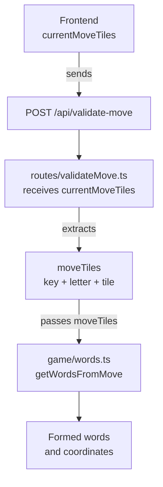

# Move Validation — Word Detection Implementation

## What We Implemented

We connected the backend's move payload to `game/words.ts` and implemented the initial word-detection logic.

### Data Flow



## `currentMoveTiles[]`

Each tile contains:

```text
key
letter
tile
```

Where:

- `key` = board coordinate, e.g. `"7,9"`
- `letter` = letter represented at that coordinate
- `tile` = tile metadata such as value, `pending`, wildcard information, and future premium information

## `game/words.ts`

The new `getWordsFromMove(moveTiles)` function:

- Creates a coordinate lookup from `moveTiles[]`.
- Checks **horizontal** connections.
- Checks **vertical** connections.
- Combines adjacent tiles into words.
- Requires at least **2 connected tiles** to form a word.
- Returns the detected word and its affected positions.
- Allows existing tiles to participate in the word.
- Uses `tile.pending === true` to determine whether the word was actually affected by the current move.
- Ignores existing words that contain **no pending tile**.

Example:

```text
7,7 C  pending:false
7,8 A  pending:false
7,9 T  pending:true
```

Produces:

```ts
{
  word: "CAT",
  positions: ["7,7", "7,8", "7,9"]
}
```

## Current Output

```ts
export type FormedWord = {
  word: string;
  positions: string[];
};
```

So the result is:

```ts
[
  {
    word: "CAT",
    positions: ["7,7", "7,8", "7,9"],
  },
];
```

## Deliberately Not Implemented Yet

At this stage, we are **not** doing:

- Dictionary validation
- CSW/NWL lookup
- Score calculation
- Double/triple letter scoring
- Double/triple word scoring
- Bingo calculation
- Wildcard scoring

The wildcard information remains available through `tile` so it can be handled properly in a later stage.

## Current Architecture

```text
Frontend
   ↓
currentMoveTiles[]
   ↓
routes/validateMove.ts
   ↓
moveTiles[]
   ↓
game/words.ts
   ↓
formed words + positions
```

This gives us the **working word-detection foundation** while keeping dictionary validation and scoring as separate future stages.
