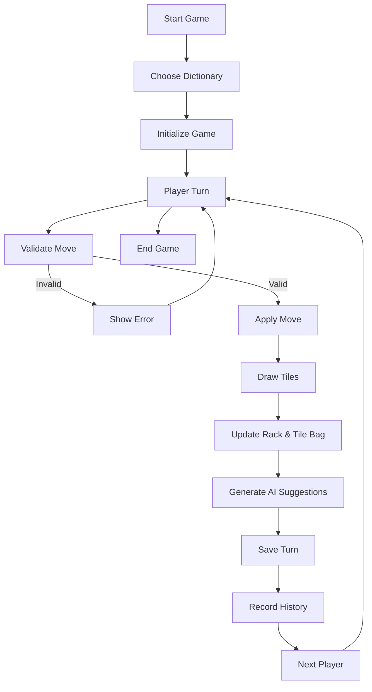

```mermaid
flowchart TD

A[Start Game]
-->B[Choose Dictionary]

B-->C[Initialize Game]

C-->D[Player Turn]

D-->E[Validate Move]

E-- Invalid -->F[Show Error]
F-->D

E-- Valid -->G[Apply Move]

G-->H[Draw Tiles]

H-->I[Update Rack & Tile Bag]

I-->J[Generate AI Suggestions]

J-->K[Save Turn]

K-->L[Record History]

L-->M[Next Player]

M-->D

D-->N[End Game]
```