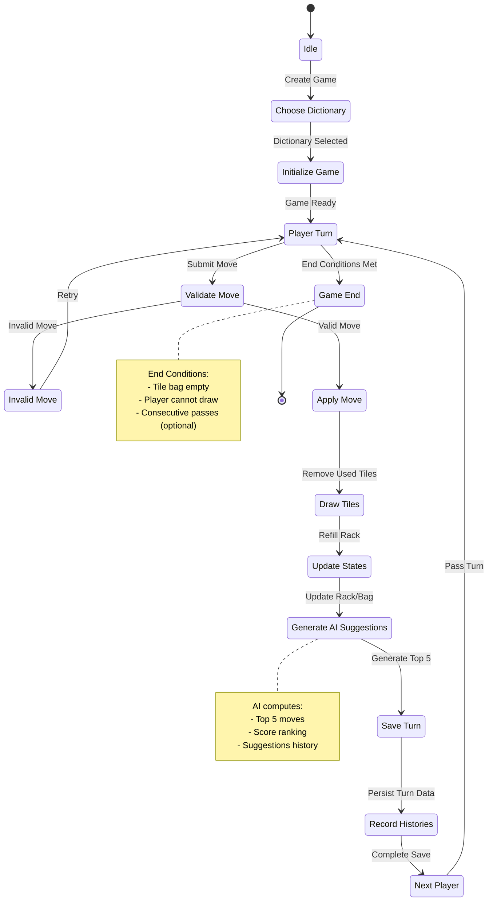

```mermaid
stateDiagram-v2

[*] --> Idle

state "Idle" as Idle
state "Choose Dictionary" as Dictionary
state "Initialize Game" as Initialize
state "Player Turn" as PlayerTurn
state "Validate Move" as Validate
state "Invalid Move" as Invalid
state "Apply Move" as Apply
state "Draw Tiles" as Draw
state "Update States" as Update
state "Generate AI Suggestions" as Suggest
state "Save Turn" as Save
state "Record Histories" as History
state "Next Player" as NextPlayer
state "Game End" as EndGame

Idle --> Dictionary : Create Game
Dictionary --> Initialize : Dictionary Selected
Initialize --> PlayerTurn : Game Ready

PlayerTurn --> Validate : Submit Move

Validate --> Invalid : Invalid Move
Invalid --> PlayerTurn : Retry

Validate --> Apply : Valid Move

Apply --> Draw : Remove Used Tiles
Draw --> Update : Refill Rack
Update --> Suggest : Update Rack/Bag
Suggest --> Save : Generate Top 5
Save --> History : Persist Turn Data
History --> NextPlayer : Complete Save

NextPlayer --> PlayerTurn : Pass Turn

PlayerTurn --> EndGame : End Conditions Met
EndGame --> [*]

note right of EndGame
End Conditions:
- Tile bag empty
- Player cannot draw
- Consecutive passes (optional)
end note

note right of Suggest
AI computes:
- Top 5 moves
- Score ranking
- Suggestions history
end note

```