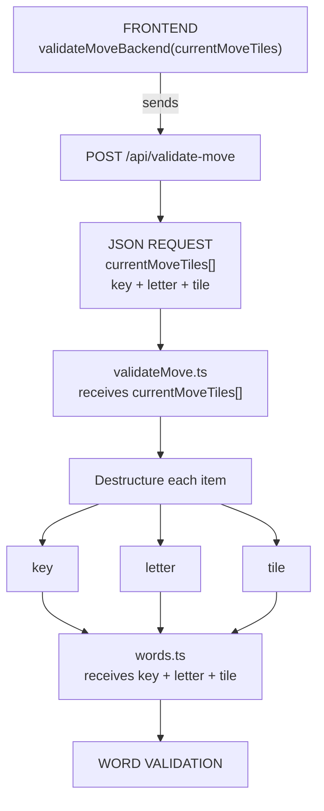

# Move Validation Data Flow — Frontend to Backend Word Validation

```mermaid
flowchart TD
    A["FRONTEND<br/>validateMoveBackend(currentMoveTiles)"]
    B["POST /api/validate-move"]
    C["JSON REQUEST<br/>currentMoveTiles[]<br/>key + letter + tile"]
    D["validateMove.ts<br/>receives currentMoveTiles[]"]
    E["Destructure each item"]
    F["key"]
    G["letter"]
    H["tile"]
    I["words.ts<br/>receives key + letter + tile"]
    J["WORD VALIDATION"]

    A -->|sends| B
    B --> C
    C --> D
    D --> E
    E --> F
    E --> G
    E --> H
    F --> I
    G --> I
    H --> I
    I --> J
```
