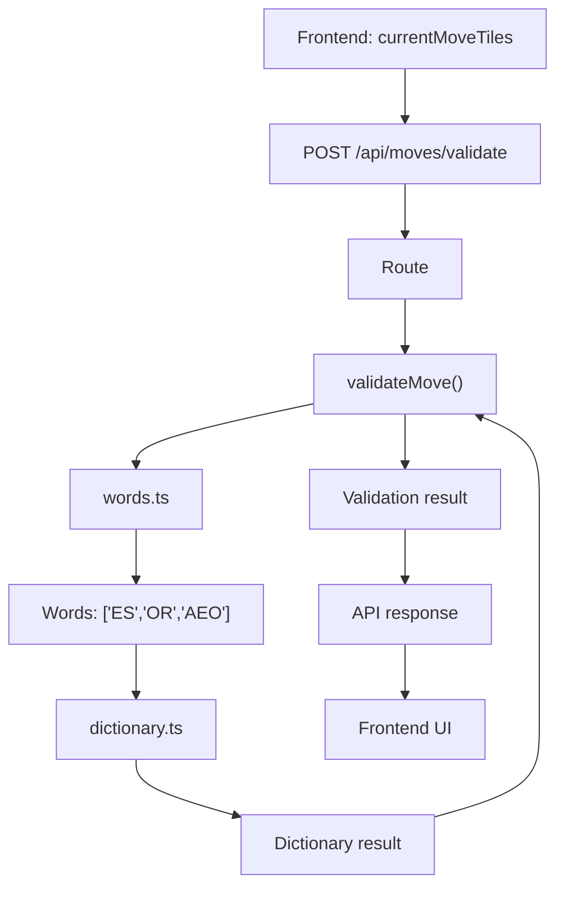

### Complete pipeline — expected outputs



**1. Frontend → API**

Input:

```ts
currentMoveTiles = [
  { key: "10,6", letter: "E", tile: {...} },
  { key: "10,7", letter: "S", tile: {...} },
  { key: "9,6", letter: "A", tile: {...} },
  { key: "11,6", letter: "O", tile: {...} },
  { key: "9,7", letter: "R", tile: {...} }
]
```

Send only:

```json
{
  "currentMoveTiles": [
    { "key": "10,6", "letter": "E" },
    { "key": "10,7", "letter": "S" },
    { "key": "9,6", "letter": "A" },
    { "key": "11,6", "letter": "O" },
    { "key": "9,7", "letter": "R" }
  ]
}
```

**2. `words.ts`**

```text
currentMoveTiles
      ↓
words.ts
      ↓
{ words: ["ES", "OR", "AEO"] }
```

Its only responsibility: **extract every Scrabble word formed by the move.**

**3. `dictionary.ts`**

```text
["ES", "OR", "AEO"]
        ↓
   CSW dictionary
        ↓
ES  → found ✅
OR  → found ✅
AEO → missing ❌
```

Output:

```ts
{
  valid: false,
  invalidWords: ["AEO"],
  dictionary: "CSW"
}
```

**4. `validateMove()`**

Combines extraction + dictionary validation:

```ts
{
  valid: false,
  invalidWords: ["AEO"]
}
```

**5. API response**

Invalid:

```json
{
  "valid": false,
  "invalidWords": ["AEO"],
  "dictionary": "CSW"
}
```

Valid:

```json
{
  "valid": true,
  "invalidWords": [],
  "dictionary": "CSW"
}
```

**6. Frontend UI**

```text
valid: false → 🔴 red borders → Submit disabled
valid: true  → 🟢 green borders → Submit enabled
```

### Final contract

```text
currentMoveTiles
      ↓
   words.ts
      ↓
  formed words
      ↓
 dictionary.ts
      ↓
dictionary result
      ↓
validateMove()
      ↓
validation result
      ↓
API response
      ↓
frontend UI
```

**Key requirement:** every stage must define **input → responsibility → exact expected output**.
